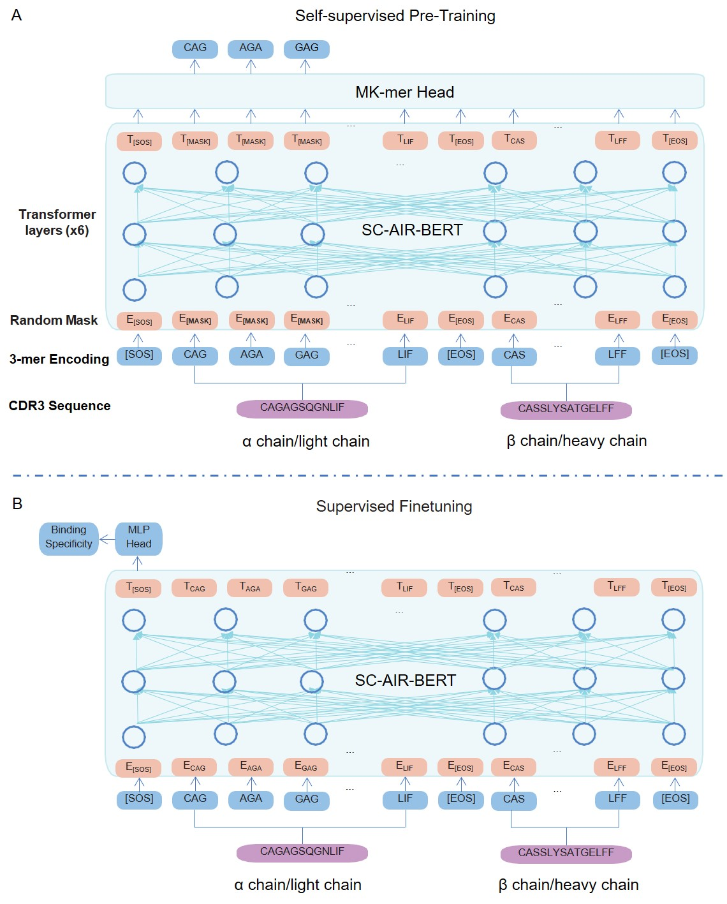

# SC-AIR-BERT

[](https://www.python.org/) 

### SC-AIR-BERT: A pre-trained single-cell model for predicting the antigen binding specificity of the adaptive immune receptor
Predicting the antigen binding specificity of the adaptive immune receptor (AIR), i.e. the T-cell receptor (TCR) and B-cell receptors (BCR), is crucial for discovering new immune therapies. However, the sequence diversity of the paired AIR chains limits the prediction accuracy of the current methods. In this study, we present a pre-trained model SC-AIR-BERT to learn the comprehensive sequence representations of paired AIR chains for improving the prediction of the antigen binding specificity of the AIR. In the first phase, SC-AIR-BERT learns the "language" of the AIR sequences by self-supervised pre-training on the collected large cohort of paired AIR chains from multiple single-cell resources. Then the SC-AIR-BERT is fine-tuned  with an MLP (multilayer perception) head for the binding specificity prediction of AIR. SC-AIR-BERT employs the K-mer strategy to enhance the sequence representation learning of the paired AIR chains. Extensive experiments demonstrate the superior AUC (Area Under Curve) performance of SC-AIR-BERT in predicting the binding specificity compared to current methods for TCR and BCR, respectively.



<center>Overview of the SC-AIR-BERT. The backbone of SC-AIR-BERT is an encoder consisting of six bidirectional Transformer layers. It has different heads in the self-supervised pre-training stage and supervised fine-tuning/inference stage. (A) At the self-supervised pretraining stage, unlabelled data were collected and utilized to pre-train the model to learn the language code of paired TCR/BCR chains. After 3-mer encoding, the encoded TCR/BCR paired chains are randomly masked parts of them and then input into the encoder component of SC-AIR-BERT. The Mk-mer head works as a reconstructor to generate the predictions of the masked parts of TCR/BCR sequences. The reconstruction loss is calculated referring to the gap between the ground truth and prediction of the masked sequence parts. (B) At the supervised fine-tuning stage, the task-specific TCR/BCR sequences are input into the pre-trained encoder of SC-AIR-BERT. The output representation then passed a multilayer perceptron (MLP) head to transform the learned embedding into the probability for each antigen-binding specificity. In the inference stage, the obtained weights and architecture of SC-AIR-BERT in the supervised fine-tuning stage are directly applied to make predictions for unseen data. </center>

# System requirements
## Hardware requirements
`SC-AIR-BERT` package requires only a standard computer with enough RAM and a NVIDIA GPU to support operations.
## Software requirements
### OS requirements
This tool is supported for Linux. The tool has been tested on the following systems: <br>
+ CentOS Linux release 8.2.2.2004
+ Ubuntu 18.04.5 LTS
### Python dependencies
`SC-AIR-BERT` mainly depends on the Python scientific stack.   <br>

+ The important packages including:
```
    numpy==1.18.5
    pandas==1.1.5
    torch==1.7.0+cu101
    torchaudio==0.7.0
    torchvision==0.8.1+cu101
    scikit-learn==0.23.2
```
+ `./requirements.txt` describes more details of the requirements.    

# Install guide

## For conda users

### 1-Configure the enviroment.
```
git clone https://github.com/TencentAILabHealthcare/SC-AIR-BERT.git 
cd ./SC-AIR-BERT
conda create -n SC_AIR_BERT python=3.6.8
conda activate SC_AIR_BERT
pip install numpy==1.18.5 pandas==1.1.5 torch==1.7.0+cu101 torchaudio==0.7.0 torchvision==0.8.1+cu101 scikit-learn==0.23.2
conda install cuda -c nvidia
conda deactivate
```

### 2-Runing

(1) Self-supervised pre-training

    python3 ./code/bert/main_mlm.py \
    --train_dataset ./data/pretrain/train.tsv \
    --test_dataset ./data/pretrain/test.tsv \
    --vocab_path ./data/vocab/vocab_3mer.pkl \
    --output_path ./result/pretrain \
    --seq_len  79 \
    --num_workers 32 \
    --embedding_mode normal \
    --NNI_Search 0 \
    --lr 0.0001 \
    --epochs 50 \
    --hidden 512 \
    --layers 6 \
    --attn_heads 4 \
    --batch_size 16 \
    --prob 0.1 \
    --process_mode MLM

The pretrained model is given in : `./checkpoint/pretrain_models/ab_3mer_len79`

(2) Supervised fine-tuning for antigen specificity prediction

    python3 ./code/classification/train.py \
    --vocab_path ./data/vocab/vocab_3mer.pkl \
    --train_dataset ./data/classification/Ebola/train.tsv \
    --valid_dataset ./data/classification/Ebola/valid.tsv \
    --test_dataset ./data/classification/Ebola/test.tsv \
    --bert_model ./checkpoint/pretrain_models/ab_3mer_len79 \
    --output_path ./result/finetuning \
    --lr_b 0.0001 \
    --lr_c 0.001 \
    --seq_len  79 \
    --prob 0.0 \
    --finetune 1 \
    --NNI_Search 0 \
    --in_features 512 \
    --class_name 1 \
    --chain 2 \
    --batch_size 32 \
    --seed 27

The obtained models are given in : `./checkpoint/finetuning/`

(3) Inference
    
    python3 ./code/classification/inference.py \
    --vocab_path ./data/vocab/vocab_3mer.pkl \
    --test_dataset ./data/classification/10x/ELAGIGILTV/test.tsv \
    --seq_len 79 \
    --class_name ELAGIGILTV \
    --load_model ./checkpoint/finetuning/10x/ELAGIGILTV/model.pth \
    --output_path ./result/inference/test.tsv

# Dataset:

Data are given in `./data`

# Disclaimer
This tool is for research purpose and not approved for clinical use.

This is not an official Tencent product.

# Coypright

This tool is developed in Tencent AI Lab.

The copyright holder for this project is Tencent AI Lab.

All rights reserved.